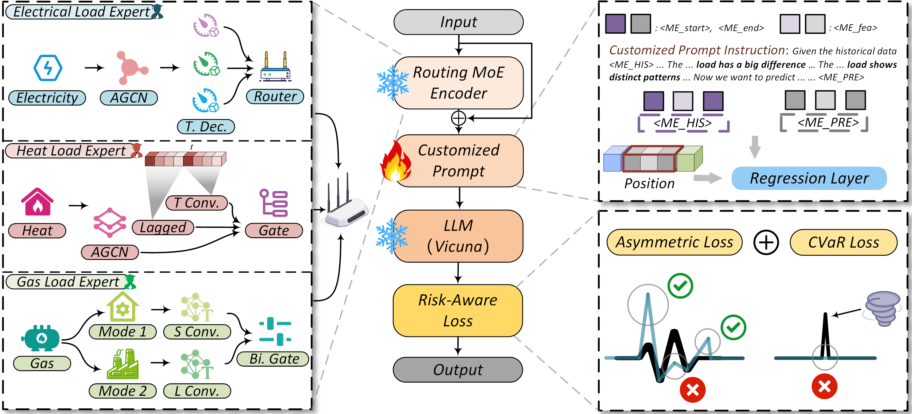

# RSynLLM: A Risk-Aware Routing Mixture-of-Experts Large Language Model for Multi-energy Load Forecasting in Large-scale Power Distribution Networks

Shijie Li<sup>a</sup>, Lin Wu<sup>a</sup>, Tianjiao Peng<sup>a</sup>, Jiesheng Huang<sup>a</sup>, Huaiguang Jiang<sup>a</sup> (Corresponding author), Ying Xue<sup>b</sup>, Jun Zhang<sup>c</sup>, David Wenzhong Gao<sup>d</sup>  

<sup>a</sup>School of Future Technology, South China University of Technology, Guangzhou 510641, China

<sup>b</sup>School of Electric Power Engineering, South China University of Technology, Guangzhou 510641, China

<sup>c</sup>School of Electrical Engineering and Automation, Wuhan University, Wuhan 430072, China

<sup>d</sup>Department of Electrical and Computer Engineering, University of Denver, CO 80208, USA

-----

## Abstract

*Accurate prediction of multi-energy loads serves as a vital foundation for ensuring the safe and efficient operation of power distribution networks (PDNs). However, existing methods often overlook the physical characteristics of different energy loads, which makes it challenging to precisely capture their spatio-temporal evolution patterns. Moreover, these methods typically focus on minimizing statistical errors, without considering the misalignment between prediction accuracy and scheduling objectives. To address these limitations, we propose a novel model named risk-aware synergy large language model (RSynLLM). This model incorporates a routing mixture-of-experts framework, with tailored load experts designed to thoroughly analyze the distinct physical characteristics of various energy loads. A dynamic router adaptively assigns weights to these experts based on their respective contributions. Additionally, we introduce a risk-aware loss function that asymmetrically evaluates prediction errors while explicitly quantifying tail risks. This drives the LLM to actively suppress load underestimation tendencies and mitigate the risks of sudden disturbances, thereby aligning prediction outcomes with decision-making objectives. Furthermore, customized prompt instructions are designed to guide the LLM in accurately perceiving the spatio-temporal evolution patterns of multi-energy loads. Extensive simulations conducted on a newly constructed large-scale multi-energy PDN dataset, built using real-world data, demonstrate that the proposed RSynLLM consistently achieves state-of-the-art performance in both prediction accuracy and risk awareness.*



## Highlights of Our Model

* A routing mixture-of-experts framework is proposed to thoroughly analyze the inherent physical characteristics of different energy loads.
* A risk-aware loss function is introduced to actively mitigate the underestimation of multi-energy loads and disruptive risks in PDNs.
* Customized prompt instructions are designed to guide LLMs in perceiving the spatio-temporal evolution of various energy loads.
* A novel large-scale M-PDN is constructed using real data to validate the superior performance of the proposed RSynLLM.

## Simulation Setting

Our simulations utilize the powerful [Vicuna-7B](https://dl.acm.org/doi/abs/10.5555/3666122.3668142) as the foundational LLM for RSynLLM. Both the observed time steps and the prediction time steps are set to 12, with a time scale of 1 hour. This enables us to achieve multi-energy load forecasting 1 to 12 hours in advance, providing flexibility for short-term energy planning. The dataset is divided into training, validation, and test sets in a 1:1:1 ratio.

Standard evaluation metrics, including root mean square error (RMSE), mean absolute error (MAE), and mean absolute percentage error (MAPE), are used to quantify the discrepancy between the predicted results and actual labels. These [metrics](https://ieeexplore.ieee.org/document/10219063), which do not distinguish between positive and negative errors, allow for a comprehensive evaluation of the proposed RSynLLM. All neural networks are implemented based on PyTorch and trained and tested on 8 NVIDIA A800 80GB GPUs / 8 NVIDIA H100 80GB GPUs. Key hyperparameter settings are presented as follows:

|                        Hyperparameter                        |      Value      |
| :----------------------------------------------------------: | :-------------: |
|               Order of Chebyshev polynomials 𝐾               |        3        |
| Different embedding dimensions 𝐷, 𝐺<sub>d</sub>, 𝑇<sub>d</sub> |   96, 96, 96    |
|        𝐵<sub>d</sub> , 𝑉<sub>d</sub> , 𝐹<sub>d</sub>         |  96, 4096, 256  |
|                    Activation function 𝜎                     |      ReLU       |
|                   Number of delay steps 𝑑𝑒                   |       12        |
|                      Confidence level 𝛿                      |       95%       |
|                      Weighted penalty 𝜌                      |       0.2       |
|      Loss weight of the 𝑐-th energy load 𝜆<sub>c</sub>       | [0.6, 0.1, 0.3] |
|  Penalty coefficient for negative deviations 𝑢<sub>c</sub>   |    [3, 6, 2]    |
|  Penalty coefficient for positive deviations 𝑜<sub>c</sub>   |    [1, 1, 1]    |
|                          Batch Size                          |        4        |
|                         Random seed                          |       42        |
|                        Learning rate                         |      0.001      |
|                       Number of epochs                       |        3        |
|                          Optimizer                           |      Adam       |
|                          Precision                           |    BFloat16     |
|        Observed time steps 𝛼/ Prediction time steps 𝛽        |     12 / 12     |
|                  Number of attention heads                   |       32        |
|                   Number of hidden layers                    |       32        |

Currently, only the Routing MoE Encoder code has been organized. The complete code will be available soon.

## Getting Started

<span id='all_catelogue'/>

### Table of Contents:

* <a href='#Environment'>1. Environment </a>
* <a href='#Training RSynLLM'>2. Training RSynLLM</a>
    * <a href='#Prepare Pre-trained Checkpoint'>2.1. Prepare Pre-trained Checkpoint</a>
    * <a href='#Instruction Tuning'>2.2. Instruction Tuning</a>
* <a href='#Evaluating RSynLLM'>3. Evaluating RSynLLM</a>
    * <a href='#Preparing Checkpoints and Data'>3.1. Preparing Checkpoints and Data</a>
    * <a href='#Running Evaluation'>3.2. Running Evaluation</a>
    * <a href='#Evaluation Metric Calculation'>3.3. Evaluation Metric Calculation</a>

<span id='Environment'/>

### 1. Environment

Please first clone the repo and install the required environment, which can be done by running the following commands:

```shell
conda create -n RSynLLM python=3.9.13

conda activate RSynLLM

# Torch with CUDA 11.8 / 11.7
pip install torch==2.0.1+cu118 torchvision==0.15.2+cu118 torchaudio==2.0.2+cu118 -f https://download.pytorch.org/whl/torch_stable.html

# To support vicuna base model
pip3 install "fschat[model_worker,webui]"

# To install pyg and pyg-relevant packages
pip install torch_geometric
pip install pyg_lib torch_scatter torch_sparse torch_cluster torch_spline_conv -f https://data.pyg.org/whl/torch-2.0.1+cu118.html

# Clone our RSynLLM or download it
git clone https://github.com/lishijie15/RSynLLM.git
cd RSynLLM

# Install required libraries
# (The recommendation is to install separately using the following method)
pip install deepspeed
pip install ray
pip install einops
pip install wandb
pip install flash-attn==2.3.5
pip install transformers==4.34.0

# （or you can install according to the requirements file.）
pip install -r requirements.txt
```

<span id='Training RSynLLM'/>

### 2. Training RSynLLM

<span id='Prepare Pre-trained Checkpoint'/>

#### 2.1. Preparing Pre-trained Checkpoint

RSynLLM is trained based on following excellent existing models.
Please follow the instructions to prepare the checkpoints.

- `Vicuna`:
  Prepare our base model Vicuna, which is an instruction-tuned chatbot and base model in our implementation. Please
  download its weights [here](https://github.com/lm-sys/FastChat#model-weights). We generally utilize v1.5 and v1.5-16k
  model with 7B parameters. You should update the 'config.json' of vicuna, for example, the 'config.json' in v1.5-16k
  can be found in [config.json](https://huggingface.co/datasets/bjdwh/checkpoints/blob/main/train_config/config.json)

- `MoE Encoder`:

  we design tailored load experts and integrate dynamic routers. This enables precise modeling of load-specific differences while dynamically allocating weights based on expert contributions to spatio-temporal evolution, providing LLMs with comprehensive multi-energy load representation information. 
  
- `M-PDN Data`:

  To closely simulate real-world PDNs incorporating heat and gas loads, we construct a novel large-scale multi-energy PDN (M-PDN) benchmark. These data are organized in [power_heat](./power_heat/train_heat/).

<span id='Instruction Tuning'/>

#### 2.2. Instruction Tuning

* **Start tuning:** After the aforementioned steps, you could start the instruction tuning by filling blanks
  at [RSynLLM_train.sh](./RSynLLM_train.sh). There is an example as below:

```shell
# to fill in the following path to run our RSynLLM!
model_path=./checkpoints/vicuna-7b-v1.5-16k
instruct_ds=./power_heat/train_heat/train_heat.json
st_data_path=./power_heat/train_heat/train_heat.pkl 
pretra_ste=MoE_Encoder
output_model=./checkpoints/MoE_Encoder_7b

wandb offline
python -m torch.distributed.run --nnodes=1 --nproc_per_node=8 --master_port=20001 \
    RSynLLM/train/train_heat.py \
    --model_name_or_path ${model_path} \
    --version v1 \
    --data_path ${instruct_ds} \
    --st_content ./TAXI.json \
    --st_data_path ${st_data_path} \
    --st_tower ${pretra_ste} \
    --tune_st_mlp_adapter True \
    --st_select_layer -2 \
    --use_st_start_end \
    --bf16 True \
    --output_dir ${output_model} \
    --num_train_epochs 3 \
    --per_device_train_batch_size 4 \
    --per_device_eval_batch_size 4 \
    --gradient_accumulation_steps 1 \
    --evaluation_strategy "no" \
    --save_strategy "steps" \
    --save_steps 4800 \
    --save_total_limit 1 \
    --learning_rate 2e-3 \
    --weight_decay 0. \
    --warmup_ratio 0.03 \
    --lr_scheduler_type "cosine" \
    --logging_steps 1 \
    --tf32 True \
    --model_max_length 2048 \
    --gradient_checkpointing True \
    --lazy_preprocess True \
    --report_to wandb
    
```

<span id='Evaluating RSynLLM'/>

### 3. Evaluating RSynLLM

<span id='Preparing Checkpoints and Data'/>

#### 3.1. Preparing Checkpoints and Data

* **Checkpoints:** You could try to evaluate RSynLLM by using your own model or our released checkpoints.
* **Data:** We create instruction data for the M-PDN to be used in evaluation. Please refer to the [evaluating](./RSynLLM_eval.sh).

<span id='Running Evaluation'/>

#### 3.2. Running Evaluation

You could start the second stage tuning by filling blanks at [RSynLLM_eval.sh](./RSynLLM_eval.sh). There is an
example as below:

```shell
# to fill in the following path to evaluation!
output_model=./checkpoints/MoE_Encoder_7b
datapath=./power_heat/test_heat/test_heat.json
st_data_path=./power_heat/test_heat/test_heat.pkl
res_path=./result_test/MoE_Encoder_7b_eval
start_id=0
end_id=593208
num_gpus=8

python ./RSynLLM/eval/test_RSynLLM.py --model-name ${output_model}  --prompting_file ${datapath} --st_data_path ${st_data_path} --output_res_path ${res_path} --start_id ${start_id} --end_id ${end_id} --num_gpus ${num_gpus}
```

#### 3.3. Evaluation Metric Calculation

<span id='Evaluation Metric Calculation'/>

You can use [result_infer.py](./metric_calculation/result_infer.py) to calculate the performance metrics of the predicted
results.
